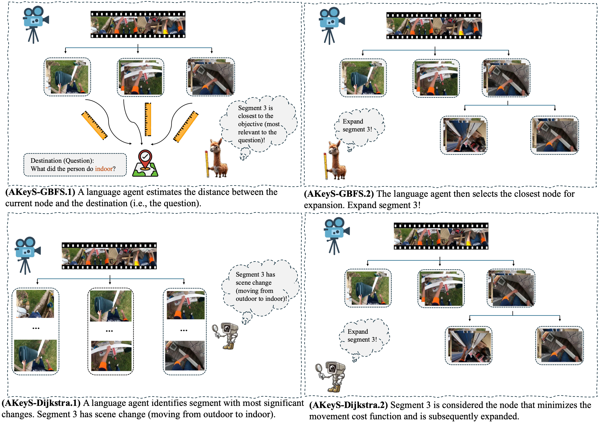
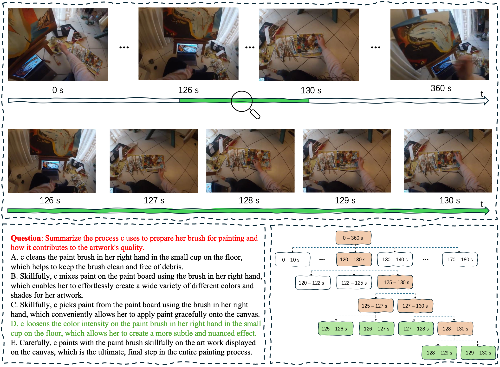
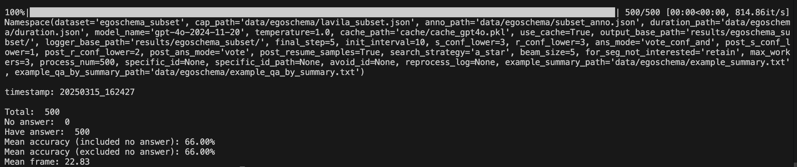
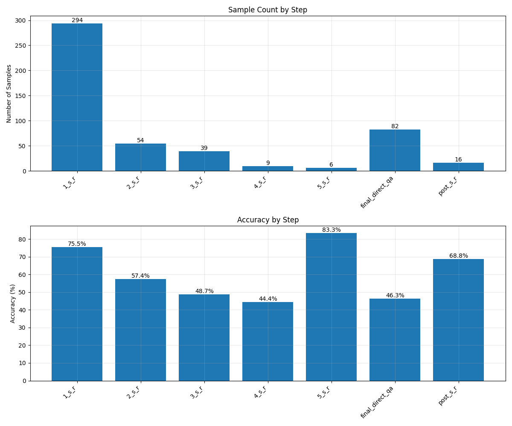

# 🌲 AKeyS: Agentic Keyframe Search for Video Question Answering

TODO: add arxiv url

## News and Todo 🗓️

- [x] Release Code for Demo

- [x] Release Code for EgoSchema

- [ ] Release Code for NExT-QA

## Introduction 

​	We present **Agentic Keyframe Search (AKeyS)**, a simple yet powerful algorithm for identifying keyframes in the VideoQA task. It can effectively distinguish key information from redundant, irrelevant content by leveraging modern language agents to direct classical search algorithms. Specifically, we first segment the video and organize it as a tree structure. Then, AKEYS uses a
language agent to estimate heuristics and movement costs while dynamically expanding nodes. Finally, the agent determines if sufficient keyframes have been collected based on termination conditions and provides answers. Extensive experiments on the EgoSchema and NExT-QA datasets show that AKEYS outperforms all previous methods with the highest keyframe searching efficiency, which means it can accurately identify key information and conduct effective visual reasoning with minimal computational overhead. For example, on the EgoSchema subset, it achieves 1.8% higher accuracy while processing only 43.5% of the frames compared to VideoTree.



## Installation Steps 🛠️

Our TreeVideoAgent does not require many computational resources; it can run on a personal computer without GPU.

1. Clone the repository 📦:

   ```python
   git clone git@github.com:fansunqi/TreeVideoAgentPublic.git
   cd TreeVideoAgentPublic
   ```

2. Create a virtual environment 🧹 and install the dependencies 🧑‍🍳:

   ```python
   python3 -m venv tva_env
   source tva_env/bin/activate
   pip install -r requirements.txt
   ```

3. Set up your API key 🗝️:

   Obtain an OpenAI API key and set  ```OPENAI_API_KEY``` and ```OPENAI_BASE_URL``` as environmental variables in  ```~/.zshrc``` or ```~/.bashrc```. In the ```main.py```, we will use the following codes to obtain the API key and base URL:

   ```
   api_key = os.getenv("OPENAI_API_KEY")
   base_url = os.getenv("OPENAI_BASE_URL")
   ```

## QuickStart 🚀

We present a case demo by running:

```
sh scripts/demo.sh
```

A visualized example:



## EgoSchema Experiments 🔬

We obtained the dataset annotations and extracted captions from the File [LLoVi](https://drive.google.com/file/d/13M10CB5ePPVlycn754_ff3CwnpPtDfJA/view?usp=drive_link) provided. We have already placed subset annotations and captions in ```data/egoschema/```. 

If you don't want to pay for the OpenAI API, we provide our LLM conversation cache [here](https://drive.google.com/file/d/1c_wId28ozyGEQKd5x3Zl8ugmvDVlJSED/view?usp=sharing). You can specify the cache path in ```arg_parser.py```.

For quick experiments, we provide a minimal subset (50 videos) of EgoSchema. To create this miniset, run:

```
python scripts/create_miniset.py
```

Then run the experiments on the miniset:

```
sh scripts/egoschema_miniset.sh
```

For the EgoSchema subset (500 videos), run:

```
sh scripts/egoschema_subset.sh
```

For the EgoSchema fullest, download annotations and captions from [LLoVi](https://drive.google.com/file/d/13M10CB5ePPVlycn754_ff3CwnpPtDfJA/view?usp=drive_link), specify the data path in ```arg_parser.py,``` and run:

```
sh scripts/egoschema_fullset.sh
```

The code will run an automated evaluation script and output accuracy and mean frame number like this:



For a step-by-step analysis, run:

```
python3 analyze_results.py --filepath YOUR_RESULT_JSON_FILE_PATH
```

It will output a histogram showing the number of problems solved and the accuracy at each step like this:



## Acknowledgments

We thank the developers of [LLoVi](https://github.com/CeeZh/LLoVi), [VideoTree](https://github.com/Ziyang412/VideoTree), [VideoAgent](https://github.com/wxh1996/VideoAgent) and [HCQA](https://github.com/Hyu-Zhang/HCQA) for their public code release. 

## Citation

TODO